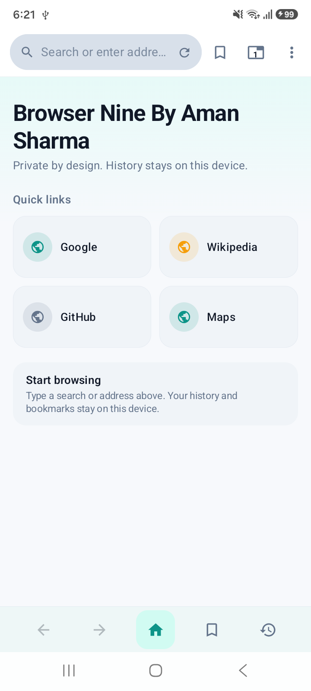
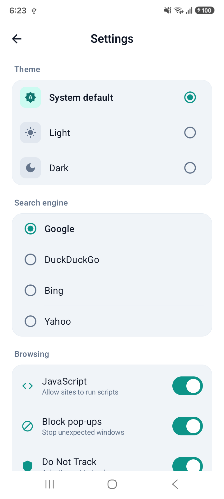
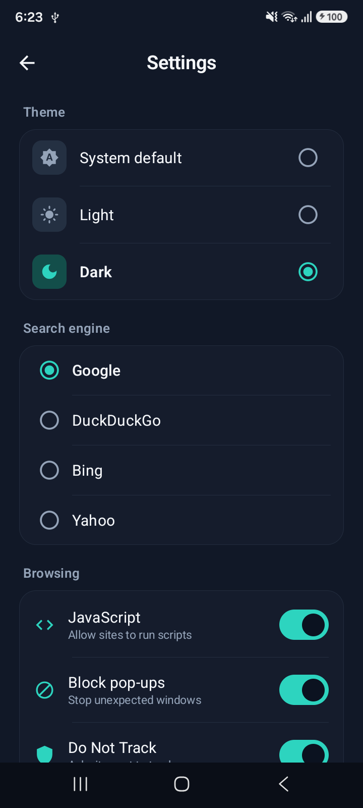

# Browser Nine by Aman

A lightweight Android web browser built with Kotlin and Jetpack Compose, focused on a clean interface, simple browsing, and user-controlled privacy settings.

  
  
  

## Features

- Clean and responsive browser interface
- Private, device-local browsing history
- Bookmarks
- Quick links
- Multiple search engine options
- Light, dark, and system themes
- JavaScript control
- Pop-up blocking
- Do Not Track option

## Project Details

- Package Name: `com.browser.app9999`
- Status: Client Project — UI, features, and availability may change in the future.

## Tech Stack

- Kotlin
- Jetpack Compose
- Android SDK
- AndroidX
- MVVM

## What I Learned

- Building a browser UI with Jetpack Compose
- Managing browsing state and user preferences
- Working with themes and responsive layouts
- Implementing browser settings and controls

## About Me

**Aman Sharma - Android Developer**

GitHub: https://github.com/engineer-aman-sharma  
LinkedIn: https://www.linkedin.com/in/engineer-aman-sharma
